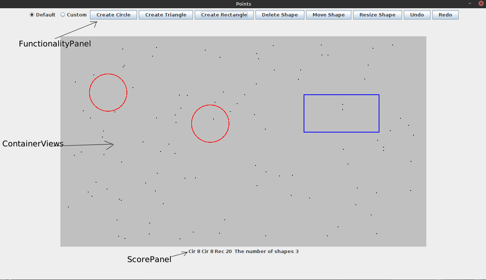

# Shapes-Game
Ce readme est disponible en deux langues: [Anglais](#english) et [Français](#français)
This readme has two languages : [English](#english) and [French](#français)

## Français:

### Intro

Le jeu de formes est un jeu où vous obtenez un certain nombre de points sur un écran, et c'est à vous de créer différents types de formes avec différentes tailles dans le but de faire en sorte que tous les points appartiennent à une forme, plus la surface de les formes, meilleur est le score.

### Layout

Pour le Layout, nous avons 3 panneaux différents :
— D’abord le panneau de fonctionnalité, ce panneau a les différents boutons utilisés pour créer des formes les supprimer et ainsi de suite, il contient également un bouton radio permettant de basculer entre le mode par défaut et le mode de création personnalisé, Je ne pouvais pas décider si je devais définir une taille de forme fixe, puis laisser l'utilisateur la redimensionner ou laisser l'utilisateur créer la taille qu'il souhaite dès le début, j'ai donc décidé d'inclure les deux et de laisser l'utilisateur décider.
— Ensuite nous avons aussi le ContainerView qui est notre surface de jeu.
— Et enfin, nous avons le panneau de score, celui-ci contient toutes nos formes avec leurs surfaces respectives, et si nous couvrons tous les points, nous obtenons un message de félicitations avec notre score.

## English:

### Intro

Shapes game is a game where you get a certain number of points on a screen, and it's up to you create different kinds of shapes with different sizes with the goal of making all of the points belong to a shape, the smaller the surface area of the shapes the better the score.

### Layout

For the Layout, we have 3 different panels:
- first the functionality panel, this panel has the different buttons used to create shapes remove them and so on, it also contains a radio button to toggle between default mode and custom creation mode, I could not decide if we need set a fixed shape size, then let the user resize it or let the user create the size he wants from the start, so I decided to include both and let the user decide.
- then we also have the ContainerView which is our playing surface.
- and finally, we have the score panel, this one contains all our shapes with their respective sizes, and if we cover all the points, we get a congratulatory message with our score.

